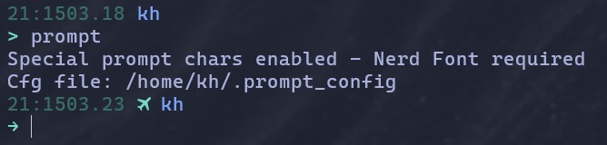
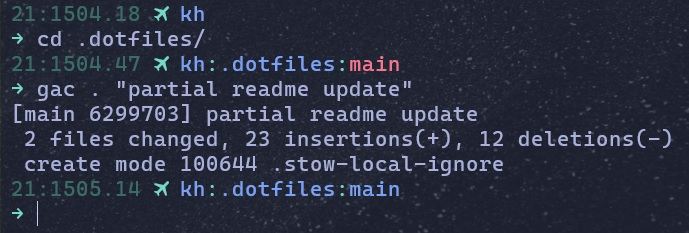

# Config collection using **GNU Stow**
If there's a utility, shell script, or user-scoped custom config file you don't want to rebuild for every new work environment, then `stow` is the tool you're after. This is how I manage a 1:1 config setup across multiple machines.

Why? If you end up programming on different devices, changing one configuration in one spot means you'll have to go to every other device and make identical changes to them, too. This makes that process simpler because you can just pull your stow repo and the changes will be synced.

Feel *free*[^1] to try out [GNU stow](https://www.gnu.org/software/stow/) for yourself.

### Installation:
Update your package manager if needed, then:
- `sudo apt install stow`
- `pacman -S stow`[^2]

There are other install options I don't use. [Read the docs](https://www.gnu.org/software/stow/manual/stow.html#Introduction) to learn more.

### Setup:
1) Create a dedicated config dir in your home (mine is `~/.dotfiles/`)
2) `mv` relevant config files/dirs into `.dotfiles/`
    - Note: I've placed the files inside their own respective "package" dirs, i.e.
        - `~/.dotfiles/nvim/`
        - `~/.dotfiles/bash/`
        - etc.
3) `cd ~/.dotfiles/` *(or whatever you named it)*
4) `stow .` to set up the symlinks

That's it, pretty hassle free. When you make any config changes, commit and push them to your own remote - then enjoy pulling it down from anywhere you need a familiar and comfortable workspace.

> [!WARNING]
> If you want to copy these configs, you'll need access to:
> > `bash`  
> > `nvim`
> > `tmux`  
> > `lsd`  
> > `pydf`  
> 
> In addition, some things may be hardcoded specific to me, so this may break your usability of certain features. I encourage you to just build your own configs and stow them yourself!
>
> But feel free to use anything interesting you find here.

# Config Details
I am mostly after tools that improve my (hobbyist, to be clear) workflow in a way that I feel is sensible. This includes a very [kickstart](https://github.com/nvim-lua/kickstart.nvim)-inspired modular Neovim config with some tweaks, a bit of a bash prompt overhaul with aliases, and my own `git` and `tmux` configs to keep things consistent.

The good news: It doesn't have to be limited to these items, and can be expanded to whatever configurations you desire.

## Bash Prompt
My basic bash prompt is just a multiline with coloring, and decorations that can be toggled.

Prompt format: `DD:HHMM.SS $USER(:pwd)(:git_branch)`

If I move into a `git` repo, the branch name will be displayed and color-coded based on the status of this branch with regard to commit history:

Notice after committing that "main" turns blue like my username and pwd. There isn't much more to my prompt besides that `prompt` command to toggle the special characters, and a venv flag if needed.

## Aliases
I use a few common aliases, like:
> `..` → `cd ..`  
`...` → `cd ../..`  
`..l` → `cd .. && ls`  
`f` → `find . | grep`  
`h` → `history . | grep`

And also a few git shortcuts:
> `gp` → `git push`  
`gs` → `git status`  
`pg` → `git pull origin`  
`log` → `git log -10 --oneline --graph`  
`log20` → `git log -20 --oneline --graph`  
`log40` → `git log -40 --oneline --graph`

 
...and centrally, the following add/commit function:

`gac {...args} {"lastArg"}` → `git add {...args} commit -m {"lastArg"}`

> [!TIP]
> Takes any number of files/dirs before a string commit message

Other functions exist like `prompt`, plus highly specific aliases to get into nvim or bash configs with short commands.
 
## Summary

Get excited about your dev environment, dive into configuring things for yourself, and know you can keep it all organized quite neatly and make it highly repeatable using `stow`.

ok  
thanks for reading this far  
**bye**

---

[^1]: FOSS forever  
[^2]: Arch btw